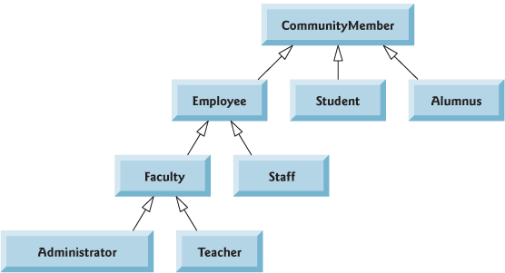

# Chapter 11 - OOP: Inheritance #

## Introduction ##

* one of the primary features of OOP
* Definition - "New class is created by absorbing an existing class's members and enhancing them with new or modified capabilities"
* Save time by reusing proven, high-performance and debugged software

### Terms ###

* **base class** - the class from the new class inherits members
* **derived class** - the new class, usually with added fiels, properties and methods
* **direct base class** - the class from which a derived class *explicitly* inherits
* **indirect base class** - any class above the direct base class in the *class hierarchy*
* **class hierarchy** - is the pedigree of the a class. Always starts with `object` class
* `object` — a C# keyword that’s an alias for System.Object
* **extends** - inherits from (all classes extend `object`)
* **single inheritance** - when a class is derived from *one* direct base class
* **multiple inheritance** - in C# this is achieved with interfaces (chapter 12)
* **is-a relationship** - an object of a derived class can be treated as an object of it's base class (IMPORTANT)
* **has-a relationship** - this is when an object contains references to objects (composition)

## Base Classes and Derived Classes ##

usually an object of one class *is-an* object of another class too.

Base classes tend to be more *general* and derived classes more *specific*.

| Base class | Derived classes |
|-|-|
| Student | GraduateStudent, UndergraduateStudent
| Shape | Circle, Triangle, Rectangle
| Loan | CarLoan, | HomeImprovementLoan, MortgageLoan
| Employee | Faculty, Staff, HourlyWorker, CommissionWorker
| SpaceObject | Star, Moon, Planet, FlyingSaucer
| BankAccount | CheckingAccount, SavingsAccount

### UML class hierarchy ###

* *hollow triangle* arrows represent an *is-a* relationship
* Employee is a CommunitMember
* You can treat an Administrato as a CommunityMember
* derived classes can **`override`** (redefine) the base-class method

## `protected` Members ##

* `protected` access offers an intermediate level between `public` and `private`
* base class's `protected` members can be accessed by members of that class and by members of its derived classes
* `protected` members cannot be accessed by clients of the class
* derived-call methods can refer to `public` and `protected` members inherited from base class
* when a derived class method overrides a base-class method the base-class version can be accessed with the `base` keyword and the access (.) operator

### Software Engineering Observation 11.1 ###

Properties and methods of a derived class cannot directly access private members of the base class.
A derived class can change the state of private base-class fields only through non-private methods and properties provided in the base class.

### Software Engineering Observation 11.2 ###

Declaring private fields in a base class helps you test, debug and correctly modify systems.
If a derived class could access its base class’s private fields, classes that inherit from that derived class could access the fields as well.
This would propagate access to what should be private fields, and the benefits of information hiding would be lost.

## Constructors in Derived Classes ##

* The derived-class constructor **before** performing its own tasks, invokes its direct base class's constructor
* if the base class is derived from another the class, the base-class constructor invokes it's base class constructor before it's own

## Software Engineering with Inheritance ##

### Software Engineering Observation 11.5 ###

Although inheriting from a class does not require access to the class’s source code,
 developers often insist on seeing the source code to understand how the class is implemented. They may, for example, want to ensure that 
 they’re extending a class that performs well and is implemented securely.

### Software Engineering Observation 11.6 ###

At the design stage in an object-oriented system, the designer often finds that certain classes are closely related.
The designer should “factor out” common members and place them in a base class.
Then the designer should use inheritance to develop derived classes, specializing them with capabilities beyond those inherited from the base class.

### Software Engineering Observation 11.7 ###

Declaring a derived class does not affect its base class’s source code. Inheritance preserves the integrity of the base class.

## Class `object` ##

* All classes inherit from class `object`
* `object` is an alias for `System.Object` 
* It's non-`static` methods are inherited by *all* classes

`object` methods inherited by all classes

* `Equals` - compares the current object to another object for equality.
* `Finalize` - cannot be explicitly called or declared. When a class contains a destructor, the compiler implicitly renames it to override the Finalize method
* `GetHashCode` - A used as the key for a hashtable when it's set as a key
* `GetType` - returns an object of class `Type` that contains info about the type such as class name
* `MemberwiseClone` - `protected` method, takes no arguments makes a copy of the object on which it was called. Shallow copy, only references are copied
* `ReferenceEquals` - `static` method recieves two `object` references, returns true if they're the same instance
* `ToString` - returns a `string` representation of the current object. Default returns namespace followed by a dot and the class name
