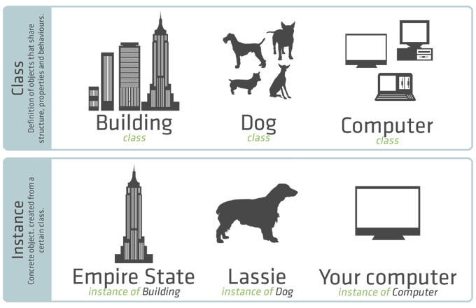
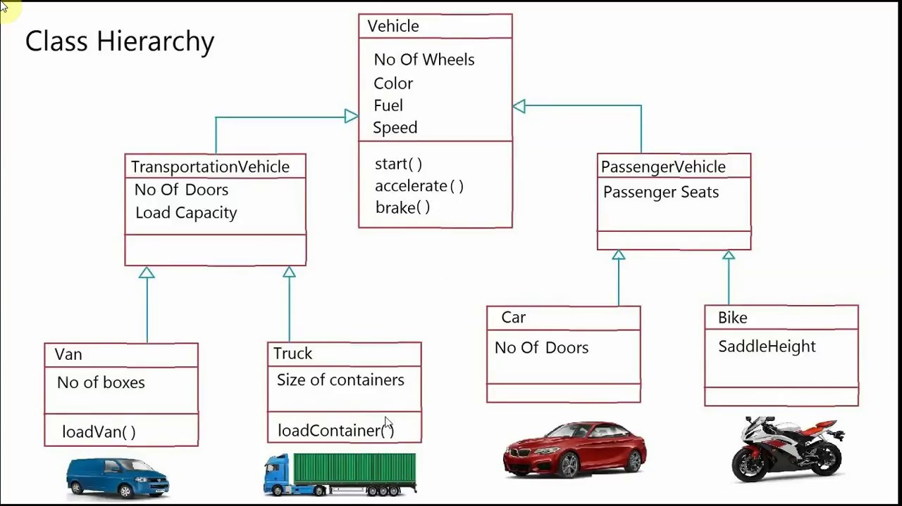

# Chapter 1 - Intro to .NET ##

## General OO Notes ##

* C# is an object-oriented languge with garbage collection
* OOP Terminology
  * **Classes** - Reusable software components. Similar to blueprints, they are used to create an object in memory.
  * **Instance** - The process of building an object from a class is called *instantiation*. An object is referred to as an instance of its class.

  * **Methods** - Behaviors of an object are written in functions called methods. It hides the implementation of the behavior from the user.
  * **Instance Variables** - Attributes of an object defined in the class. Usually are private.
  * **Properties** - Contain accessors for getting and setting instance variables.
  * **Encapsulation** - Hiding implementation details within an object. 

  * **Inheritance** - Creating a new object that absorbs the characteristics of another object.

  * **Polymorphism** - Allows the calling of objects that share the same base class as if they are all the same base class. This is the most powerful concept behind OOP. It's simple in theory but hard to master.

* C# has its roots in C, C++ and Java
  * Java came before C# and Java was very popular so C# borrows a lot from Java.
  * This helps java developers transition to C#
* Procedural languages such as FORTRAN, Pascal, BASIC and C
* Procedural - Top down with use of GOTO statements
* Object Oriented Languages like, C++, C#, Java, python, javascript, etc.
* OO uses objects to mimic real world objects. Makes it easier to reuse and maintain
* Data serialization languages
  * XML
  * JSON
  * YAML

## .NET Framework ##

* .NET Framework Class Library (FCL) is a collection of classes that enable you to develop apps quickly.
* .NET was created to facilitate the need for Web-based applications and the increase in popularity of mobile electronic devices.
* Common Language Specification (CLS) which contains the info about the storage of data types, objects, etc.
* Common Language Runtime (CLR) is what executes C# programs. (think JVM)
  * Virtual Machine - manages execution of programs
  * Managed code
    * integrating software components written in different .NET languages,
    * error handling between such components,
    * enhanced security,
    * automatic memory management and more.
* The program compiled into Microsoft Intermediate Language (MSIL)
* Then the MSIL is compiled into machine code for a particular platform when the code executes. (JIT - Just In Time Compiler)
* This scheme (like java) allows for platform independence. Once the code is written in can be executed on many
different types of computers without modification.
* .NET framework must be installed on a computer for a program to run
* Language Interoperability - components written in different .NET languages can be combined into one unified program.
* .NET languages
  * F#
  * C#
  * VB
  * C++
* .NET Core - the cross-platform subset of .NET for Windows, Linux, MacOS and FreeBSD
* Visual Studio is Microsoft's IDE that is built for .NET as well as many other languages.