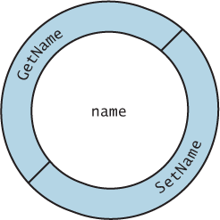

# Chapter 4 - Introduction Classes, Objects, Methods and strings #

## C# Classes ##

* Each user defined class becomes a new `type` you can use to create objects
* This makes C# an **extensible programming language**
* Classes are encapsulated code segments consisting of data (properties) and behaviors (methods)

## C# Getter and Setter Styles ##

Java style Getter and Setters:

```[c#]
class Account
{
    private string name; // instance variable

    public string GetName()
    {
        return name;
    }

    public void SetName()
    {
        name = value;
    }
}
```

C# Getter and Setter:

```[c#]
class Account
{
    private string name;

    public string Name // C# Property
    {
        get
        {
            return name;
        }
        set
        {
            name = value;
        }
    }
}
```

Syntactic Sugar:

```[c#]
class Account
{
    public string Name { get; set; } // C# Auto-implemented Property
}
```

All of the above getter and setter styles are valid in C#


Conceptual view of name instance variable and guarding layer of public methods

## Custom Accessors ##

* You can apply your own logic to the accessors for validation
* The following example shows validation for setting an account balance
* It also makes the setter private so it can only be called within the class, this will protect the balance from outside influence.

```[c#]
public class Account {
    public string Name { get; set; } // auto-implemented property
    private decimal balance; // instance variable

    public Account(string accountName, decimal initialBalance) {
        Name = accountName;
        Balance = initialBalance;
    }

    // Balance property with validation
    public decimal Balance {
        get {
            return balance;
        }
        private set { // can only be used within the class
            // validate blance is greater than 0.0
            if (value > 0.0m) {
                balance = value;
            }
        }
    }
}
```

## Constructors ##

* If you don't define a constructor for a class there is a default constructor
* The default constructor takes no arguments and just creates an object with no values
* If you define a custom constructor you can no longer use the default constructor

```[c#]
public Account(string accountName, decimal initialBalance) {
    Name = accountName;
    Balance = initialBalance;
}
```

## Methods ##

Methods can interact with properties and instance variables.

```[c#]
public void Deposit(decimal depositAmount) {
    if (depositAmount > 0.0m) {
        Balance += depositAmount;
    }
}
// method that debits amount from account balance
public void Debit(decimal debitAmount) {
    if ((Balance - debitAmount) >= 0.0m) {
        Balance -= debitAmount;
    }
}
```

## Test Classes ##

* Unit tests are an important tool for software engineers
* Visual Studio has an integrated test framework called MS Test
* Tests for custom classes are vital

### Creating Unit Test Project ###

* After defining a custom class with a public method
  1. right click on the method > **Create Unit Tests**
  2. create test wizard will open
  3. define name schemes for test project, test class and method tests
  4. click ok to create the test project and unit test

### TDD ###


* Every method should have a unit test written for it
* The TDD way - RED > GREEN > REFACTOR > REPEAT
* Following TDD will give you confidence to make code changes and refactoring without getting unexpected results

More on unit tests <https://docs.microsoft.com/en-us/visualstudio/test/unit-test-basics?view=vs-2019>
