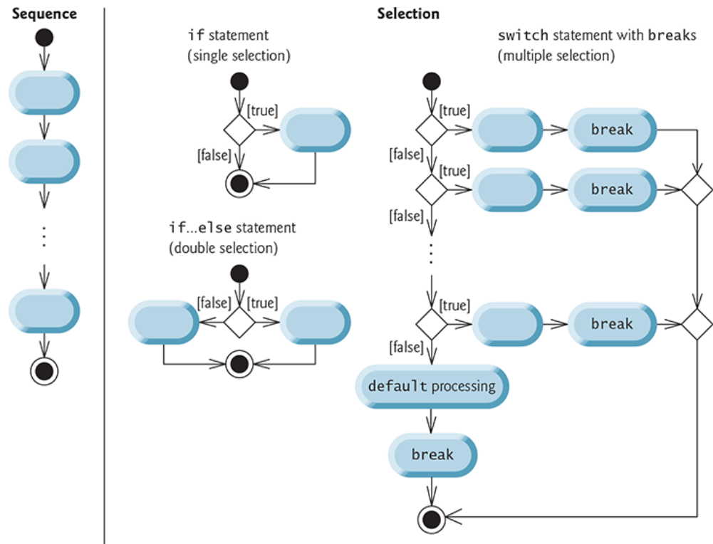
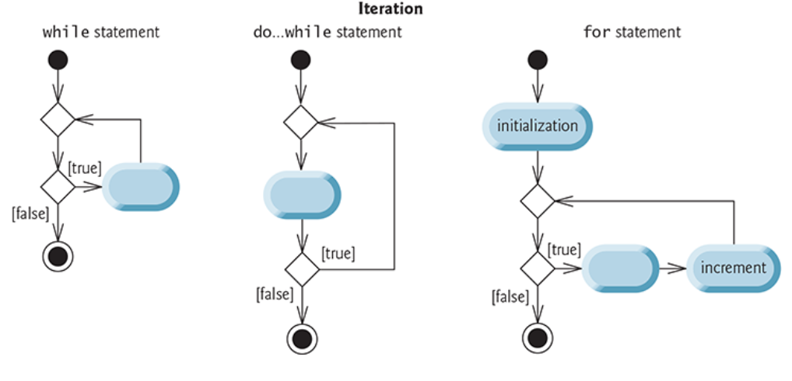

# Chapter 6 - Control Structures Part 2 #

## Counter-Controlled Iteration ##

Elements of counter-controlled iteration:

1. a control variable
2. the control variable's initial value
3. the control variables increment value
4. the loop-continuation condition that determines if looping should continue.

### `while` Iteration With Counter ###

```[C#]
// Counter-controlled iteration with the while iteration statement.

int counter = 1; // declare and initialize control variable

while (counter <= 10) // loop-continuation condition
{
    Console.Write($"{counter} ");
    ++counter; // increment control variable
}

Console.WriteLine();
```

### `for` Iteration Statement ###

* typically `for` loops are used for counter-controlled iteration
* `while` loops are used for sentinel-controlled iteration
* Both however can be used for either iteration type

```[C#]
// for statement header includes initialization,
// loop-continuation condition and increment
for (int counter = 1; counter <= 10; ++counter)
{
    Console.Write($"{counter} ");
}

Console.WriteLine();
```

General Format of a `for` Statement

```[C#]
for (initialization; loopContinuationCondition; increment)
{
  statement
}
```

* All three expressions in a `for` header are optional
* If the `loopContinuationCodition` is omitted C# assumes it's alway true
* you can obit the `initialization` expression if the app initializes the control variable before the loop
* you can omit the `increment` expression if the app calulates the increment with statements in the loop's body or if no increment is needed

## `do..while` Iteration Statement ##

* similar to the `while` statement but the continuation condition executes after the loop's body executes
* the body always executes at least once
* good for looping for user input

```[C#]
int counter = 1; // initialize counter

do
{
    Console.Write($"{counter}   ");
    ++counter;
} while (counter <= 10); // required semicolon

Console.WriteLine();
 ```

## `switch` Multiple-Selection Satement ##

Letter Grades Example Switch Statement

```[C#]
do
{
    input = Console.ReadLine()
    int grade = int.Parse(input); // read grade off user input
    total += grade; // add grade to total
    ++gradeCounter;
    switch (grade / 10)
    {
        case 9: // grade was in the 90s
        case 10: // grade was 100
            ++aCount; // increment aCount
            break; // necessary to exit switch
        case 8: // grade was between 80 and 89
            ++bCount; // increment bCount
            break; // exit switch
        case 7: // grade was between 70 and 79
            ++cCount; // increment cCount
            break; // exit switch
        case 6: // grade was between 60 and 69
            ++dCount; // increment dCount
            break; // exit switch
        default: // grade was less than 60
            ++fCount; // increment fCount
            break; // exit switch
    }
} while (input != null);

double average = (double) total / gradeCounter;
```

## `break` and `continue` Statements ##

### `break` Statement ###

* when executed in a while, for, do ...while, switch or foreach causes immediate exit

```[C$]
int count; // control variable also used after loop terminates

for (count = 1; count <= 10; ++count) // loop 10 times
{
    if (count == 5) // if count is 5,
    {
        break; // terminate loop
    }

    Console.Write($"{count} ");
}
Console.WriteLine($"\nBroke out of loop at count = {count}");
```

output

```[output]
1 2 3 4
Broke out of loop at count = 5
```

### `continue` Statement ###

* skips the remaining statements in the loop body and continues with the next iteration of the loop

```[C#]
for (int count = 1; count <= 10; ++count) // loop 10 times
{
    if (count == 5) // if count is 5,
    {
        continue; // skip remaining code in loop
    }

    Console.Write($"{count} ");
}

Console.WriteLine("\nUsed continue to skip displaying 5");
```

output

```[output]
1 2 3 4 6 7 8 9 10
Used continue to skip displaying 5
```

## Logical Operators ##

### C# Logical Operators ###

* Conditional AND `&&`
* Conditional OR `||`
* Negation `!`
* Boolean Logical AND `&`
* Boolean Logical OR `|`
* Boolean Logical XOR `^`
* Ones Complement `~`
* Left Shift `<<`
* Right Shift `>>`

### `&&` AND ###

If you want 2 or more conditions to all be true

```[C#]
// true for all females 65 and over
if (gender == 'F' && age >= 65)
...
```

`&&` Truth Table

| expression 1 | expression 2 | expression 1 `&&` expression 2 |
| ------------ | ------------ | ------------------------------ |
| true         | true         | true                           |
| false        | true         | false                          |
| true         | false        | false                          |
| false        | false        | false                          |

### `||` OR ###

If you just one of 2 or more conditions to be true

```[C#]
// true if either semseterAverage or semesterFinal are 90 or above
if (semesterAverage >= 90 || semesterFinal >= 90)
...
```

`||` Truth Table

| expression 1 | expression 2 | expression 1 `||` expression 2 |
| ------------ | ------------ | ------------------------------ |
| true         | true         | true                           |
| false        | true         | true                           |
| true         | false        | true                           |
| false        | false        | false                          |

### Boolean Logical Operators ###

* Boolean operators are different because they don't "short circuit" the other conditionals
* They can also be used for bitwise operations

### Bitwise Operators ###

Bitwise example code

```[C#]
int a = 60;            /* 60 = 0011 1100 */
int b = 13;            /* 13 = 0000 1101 */
int c = 0;

c = a & b;             /* 12 = 0000 1100 */
Console.WriteLine($"Line 1 - Value of c is {c}");

c = a | b;             /* 61 = 0011 1101 */
Console.WriteLine($"Line 2 - Value of c is {c}");

c = a ^ b;             /* 49 = 0011 0001 */
Console.WriteLine($"Line 3 - Value of c is {c}");

c = ~a;                /*-61 = 1100 0011 */
Console.WriteLine($"Line 4 - Value of c is {c}");

c = a << 2;      /* 240 = 1111 0000 */
Console.WriteLine($"Line 5 - Value of c is {c}");

c = a >> 2;      /* 15 = 0000 1111 */
Console.WriteLine($"Line 6 - Value of c is {c}");
Console.ReadLine();
```

## Structured-Programming Summary ##

### Control statements are single-entry/single-exit ###

* because every control statement has a single-entry and exit point you can stack them
* This allows for nesting as well
* this keeps programs from becoming complicated therefore easier to debug and read
* You can take the following diagrams and stack/nest them and you'll always be able to follow a flow of control



