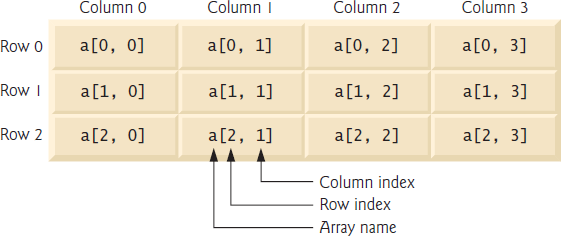

# Chapter 8 - Arrays; Introduction to Exception Handling #

## Arrays ##

* Data structures of related data items of the *same* type
* Fixed-length
* Array variable may be reassigned to a new array of a different length
* Accessing is fast `O(1)`
* Not great search speed `O(n)`

### Logical Representation of an Array ###


### Declaring and Creating Arrays ###

```[C#]
int[] c = new int[12];
```

* each element of `c` is initialized to 0 by default
* creating an array with `new` with default elements
  * `0` for `int`s
  * `false` for `bool`s
  * `null` for references

### Resizing an Array ###

* the `static` `Array.Resize()` method will create a new array with the specified length but with the original array's element values
* `Array` static class defines many methods for common array operations

```[C#]
int[] newArray = new int[5];
Array.Resize(ref newArray, 10);
```

### Using an Array Initializer ###

* comma-separated list of expressions
* array length is determined by the number of elements

``` [C#]
int[] n = {10, 20, 30, 40, 50};
```

* creates a 5 length array with elements `[10, 20, 30, 40, 50]`
* `n.Length` property equals `5`
* `Length` property is a `const` in an array which means it can't be modified

### Implicitly Typed Local Variables and Keyword `var` ###

* **type inference** is when the compiler determines the variables type based on it's *initializer*
* this is done with the `var` keyword

```[C#]
Account account1 = new Account("Jane Green");
```

from this point forward the preferred way is

```[C#]
var account1 = new Account("Jane Green");
```

More Examples

```[C#]
var values = new[] {1, 32, 13, 99, 45};
```

## Intro to Exception Handling ##

### The `try` Statement ###

* code that might `throw` an exception
* To handle exceptions, place code in `try` statement
* `catch` block contains code that *handles* the exception

### The `catch` Block ###

* declares an exception parameter's type and name
* inside the block you can interact with the exception
* exceptions have built-in `Message` property that contains the error message

```[C#]
foreach (int element in arrayOfNumbers) {
    ++someOtherArray[element];
}
```

* what could cause this foreach block to throw an exception?

```[C#]
try {
    foreach (int element in arrayOfNumbers) {
        ++someOtherArray[element];
    }
}
catch (IndexOutOfRangeException ex) {
    Console.WriteLine(ex.Message);
}
```

## Passing Arrays and Array Elements to Methods ##

* passing an array into a method passes the reference of it
* specify array parameter with the type and square brackets
  * `void ModifyArray(double[] b)`

### Pass-By-Value vs. Pass-By-Reference ###

* When passing an entire array or an array element that is of a *reference type*, the method receives a *copy of the reference*
* when an array element is a *value type* the method receives a *copy of the element's value*
* to pass value-type array element by reference use the `ref` keyword

```[C#]
int[array] = {1, 2, 3, 4}; // array of value type
ModifyArray(array); // pass array reference
ModifyElement(array[0]); // pass copy of value in element 0
ModifyElement(ref array[0]); // pass element 0 by reference
```

## Multidimensional Arrays ##

* **Two-dimensional arrays** are used to reperesent *tables of values*
* two indices are used to access an element
* can be looked at as a *row* and a *column*



### Initializer for 2-d Rectangular Array ###

```[C#]
int[,] b = {{1, 2}, {3, 4}};
```

array `b`

|       | **0** | **1** |
|-------|-------|-------|
| **0** | 1     | 2     |
| **1** | 3     | 4     |

### Jagged Arrays ###

* Lengths of rows need not be the same
* something like storing a student's exam scores across course with varying number of exams
  
### Initializer for a 2-d Jagged Array ###

```[C#]
int[][] jagged = {new int[] {1, 2},
                  new int[] {3},
                  new int[] {4, 5, 6}};
```

|       | **0** | **1** | **2** |
|-------|-------|-------|-------|
| **0** | 1     | 2     | X     |
| **1** | 3     | X     | X     |
| **2** | 4     | 5     | 6     |

### Iterating Through 2-d Arrays ###

Nested `for` loops

```[C#]
int total = 0;

for (int row = 0; row < a.GetLength(0); ++row)
{
   for (int column = 0; column < a.GetLength(1); ++column)
   {
      total += a[row, column];
   }
}
```

## Variable-Length Argument Lists ##

* allows you to create method that receive an arbitrary number of arguments
* It's an array preceded by the keyword `params`
* `params` modifier can only occur as the last parameter in a method signature

```[C#]
static double Average(params double[] numbers)
{
    var total = 0.0;
    foreach (var d in numbers)
    {
        total += d;
    }
    return numbers.Length != 0 ? total / numbers.Length : 0.0;
}

static void Main()
{
    var d1 = 10.0;
    var d2 = 20.0;
    var d3 = 30.0;
    var d4 = 40.0;

    var average = Average(d1, d2); // 15
    average = Average(d1, d2, d3); // 20
    average = Average(d1, d2, d3, d4); // 25

    double[] doubles = { d1, d2, d3, d4 };
    average = Average(doubles); // 25
}
```