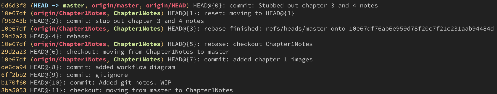
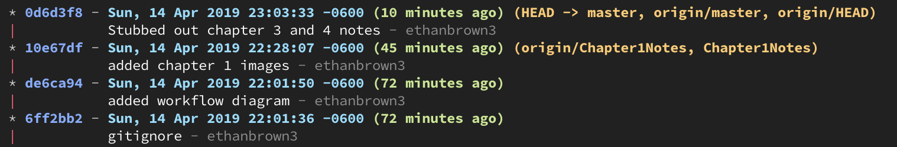

# Git Notes #

## Introduction ##

* **Distributed** version-control system
* There are many version-control systems
  * Subversion
  * Team Foundation Server
  * Mercurial
  * BitKeeper
  * much more
* Created in 2005 by THE Linus Torvalds to help with developing the Linux kernel
* As a distributed system this means that every local repo is a complete copy of the remote. This give many advantages:
  * Redundancy of source code
  * Easy recovery
  * Working remote means you don't always need a connection to access the code
* This does however come with a few complications:
  * You may end up working on the same files as another contributor and have merge conflicts
  * If you forget to pull you could do a lot of work that is incompatible with current state of the source code
  * It can be a little difficult to get used to
  * The tool is really stupid (hence the name) which ironically means you can't be

## Setup ##

Install for Windows https://gitforwindows.org

* Set github user information
  1. Open cmd prompt
  2. `> git config --global user.email "your_email@example.com"`

## Basic Git Workflow ##

### Getting Started ###

* If you are starting a new project:
  1. create a new project folder (if you are using an ide just use the folder it creates)
  2. in the console change directory to it.
        >\> `cd path/to/my/project`
  3. initialize new git repo
        >\> `git init`
  4. add remote repo
        >\> `git remote add origin https://.github.com/the-url-you-copied/repo.git`

* If you want to pick up an existing project from a remote like github:
  1. go to the repo on github and click the `clone` button
  2. It will show you a url that you can copy
  3. in your console navigate to where you would like the store the repo
        >\> `cd path/to/projects/folder`
  4. clone the repo
        >\> `git clone https://.github.com/the-url-you-copied/repo.git`

### Committing Changes ###

* Now that you have a local repo we can now start tracking code changes
* You have 3 parts of your local repository
  1. Working Directory - holds the actual files
  2. Index - staging area for commits
  3. HEAD - points to the last commit you made
* commiting changes
    1. Add changed files to the `Index`
        >\> `git add \<filename>`
    2. Commit the index files to the `HEAD`
        >\> `git commit -m "Commit message"`
    3. Push the changes to the remote repo
        >\> `git push origin master`

### Workflow Diagram ###


## Branching and Merging Workflow ##

* Branches are a way to work on new features without changing the main code base.
* To checkout a new branch:`git checkout -b "new-branch-name"`
* You can then make commits as usual
* When you are ready to merge back into master: `git checkout master` then `git merge "new-branch-name"`
* If the master has had changes since created the new branch git will resolve any merging it can
* If there is are line(s) that were modified on both branches git will require you to resolve those conflicts and then make a new commit

Rebase vs Merge

* rebasing can sound scary at first but it's really just another method of merging.
* When rebasing git will take all the commits you made on one branch and move those on top of the other
* It does the same thing as a merge it just looks like you did all your work in the rebased branch
* The best way to learn this is to use a git visualizer simulation 

## Advanced Workflows ##

### The reflog ###

You will start to love git once you learn to use `git reflog`

* reflog is used to see a history of actions on your local repo
* reverse a bad commit and rewrite history
* one of the most powerful things in git
* with great power comes something something
* just be careful



* notice the `HEAD@{#}` on each line
* this refers to how many actions from the current change that action is
* if you want to take back the last commit or action you did you would run:
  `git reset HEAD@{1}`
* this will put you `working directory` into the same state it was before that last action
* you can then keep working or if you need to set the remote repo in the same state you would then run:
  `git push --force` 
  >**WARNING:** Be very careful when rewriting history on the remote. This cannot be undone and you will cause all other contributors to get out of sync. They will have to reclone the repo.

### Aliases ###

Inside your `.gitconfig` file you can define aliases to speed up your workflow

Heres an example I use with `git log`

* visualizes your repo history
* It can take a lot of parameters
* Here are a few I like (copy to the bottom of you .gitconfig file)

    ```(config)
    [alias]
        lga = log --graph --oneline --all --decorate
        lg1 = log --graph --abbrev-commit --decorate --format=format:'%C(bold blue)%h%C(reset) - %C(bold green)(%ar)%C(reset) %C(white)%s%C(reset) %C(dim white)- %an%C(reset)%C(bold yellow)%d%C(reset)' --all
        lg2 = log --graph --abbrev-commit --decorate --format=format:'%C(bold blue)%h%C(reset) - %C(bold cyan)%aD%C(reset) %C(bold green)(%ar)%C(reset)%C(bold yellow)%d%C(reset)%n''          %C(white)%s%C(reset) %C(dim white)- %an%C(reset)' --all
        lg = !"git lg1"
    ```

* Example of `git lg2`
  

