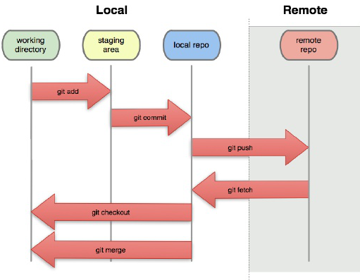

# Git Notes #

## Introduction ##

* **Distributed** version-control system
* There are many version-control systems
  * Subversion
  * Team Foundation Server
  * Mercurial
  * BitKeeper
  * much more
* Created in 2005 by THE Linus Torvalds to help with developing the Linux kernel
* As a distributed system this means that every local repo is a complete copy of the remote. This give many advantages:
  * Redundancy of source code
  * Easy recovery
  * Working remote means you don't always need a connection to access the code
* This does however come with a few complications:
  * You may end up working on the same files as another contributor and have merge conflicts
  * If you forget to pull you could do a lot of work that is incompatible with current state of the source code
  * It can be a little difficult to get used to
  * The tool is really stupid (hence the name) which ironically means you can't be

## Setup ##

Install for Windows https://gitforwindows.org

* Set github user information
  1. Open cmd prompt
  2. `> git config --global user.email "your_email@example.com"`

## Git Workflow ##

### Getting Started ###

* If you are starting a new project:
  1. create a new project folder (if you are using an ide just use the folder it creates)
  2. in the console change directory to it.
        >\> cd path/to/my/project
  3. initialize new git repo
        >\> git init
  4. add remote repo
        >\> git remote add origin https://.github.com/the-url-you-copied/repo.git

* If you want to pick up an existing project from a remote like github:
  1. go to the repo on github and click the `clone` button
  2. It will show you a url that you can copy
  3. in your console navigate to where you would like the store the repo
        >\> cd path/to/projects/folder
  4. clone the repo
        >\> git clone https://.github.com/the-url-you-copied/repo.git

### Committing Changes ###

* Now that you have a local repo we can now start tracking code changes
* You have 3 parts of your local repository
  1. Working Directory - holds the actual files
  2. Index - staging area for commits
  3. HEAD - points to the last commit you made
* commiting changes
    1. Add changed files to the `Index`
        >\> git add \<filename>
    2. Commit the index files to the `HEAD`
        >\> git commit -m "Commit message"
    3. Push the changes to the remote repo
        >\> git push origin master

### Workflow Diagram ###

